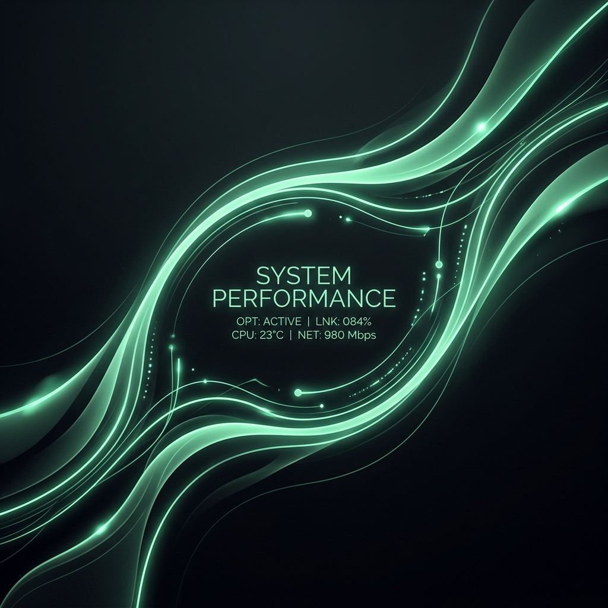
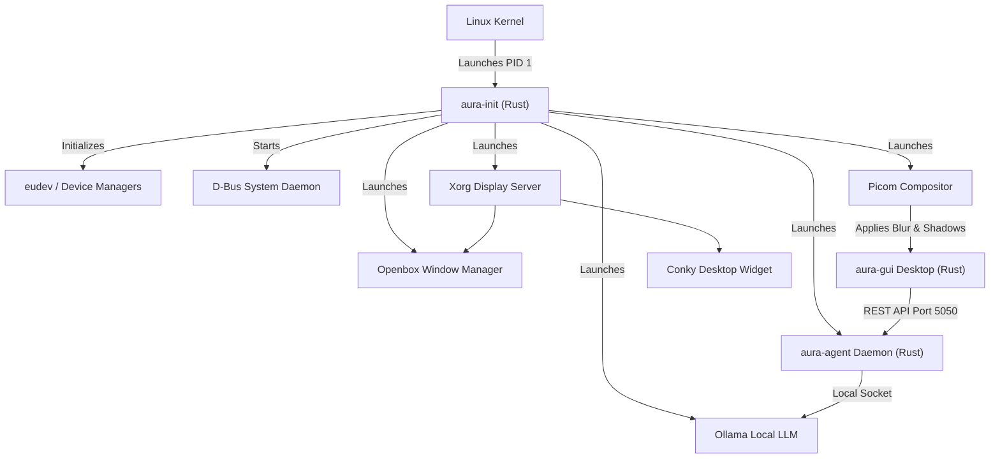

<p align="center">
  
</p>

# AuraOS ✦
<p align="center">
  <a href="https://github.com/Starmarine06/AuraOS">GitHub Repository</a> | <a href="https://github.com/Starmarine06/AuraOS/releases">Download ISO</a>
</p>
<p align="center">
  <a href="https://github.com/Starmarine06/AuraOS"></a>
  <a href="https://github.com/Starmarine06/AuraOS"></a>
  <a href="https://github.com/Starmarine06/AuraOS/blob/main/LICENSE"></a>
  <a href="https://github.com/Starmarine06/AuraOS"></a>
</p>

**The lightweight, high-performance Linux operating system built from scratch with a pure Rust init system.** It discards heavy system management layers (like systemd) in favor of `aura-init`, a statically compiled PID 1 daemon. Features a premium translucent glassmorphic desktop interface (`aura-gui`) backed by a local AI agent daemon (`aura-agent`) running a Qwen-2.5-1.5B model. Stage, commit, and push your changes automatically via Git, run Windows apps/games natively via Wine and Steam, and monitor resources with transparent desktop widgets.

<table>
<tr><td><b>Pure Rust Init System</b></td><td>A lightweight, statically compiled Rust binary running as PID 1 (<code>/init</code>). Mounts virtual filesystems, manages network interfaces, starts services, configures display devices, and automatically restarts components on exit.</td></tr>
<tr><td><b>Frosted Glass Desktop GUI</b></td><td>An <code>egui</code>-based UI powered by <code>picom</code> with dual-kawase blur. Merges circular macOS window control accents (top-left traffic lights) with a modern Windows Fluent-style dark theme. Includes spotlight math and app launcher.</td></tr>
<tr><td><b>Local AI Agent Daemon</b></td><td>A background service running on port 5050 with root access to execute bash commands, record raw input event macros, and perform Bluetooth proximity lock security.</td></tr>
<tr><td><b>Windows Compatibility</b></td><td>Pre-configured 32-bit and 64-bit glibc libraries supporting Wine, Winetricks, Steam, Lutris, and Bottles to run Windows software and games natively.</td></tr>
<tr><td><b>Desktop Widgets (Conky)</b></td><td>Transparent widgets rendered directly on the wallpaper displaying clock, uptime, real-time CPU/RAM/Disk stats, and network speeds.</td></tr>
<tr><td><b>Auto-Sync Development</b></td><td>Continuous synchronization to your GitHub repository (<code>https://github.com/Starmarine06/AuraOS</code>) keeping your workspace and code changes up to date.</td></tr>
</table>

---

## System Architecture

AuraOS is built using a multi-stage Docker environment and compiles all core OS orchestration components statically in Rust.



---

## Quick Start

### Build the Bootable ISO

AuraOS is built inside a multi-stage Docker builder to ensure a reproducible toolchain and clean compilation environment.

**Prerequisites:** Docker Desktop (Windows) or standard Docker engine (Linux/macOS).

Run the build script in your terminal:

```bash
./build-iso.sh
```

This will automatically:
1. Validate your Docker environment.
2. Compile all Rust crates (`aura-init`, `aura-gui`, `aura-agent`) statically.
3. Build the bootable ISO file and output it to `out/auraos.iso`.

### Run in a Virtual Machine

Set up a VM in VMware, VirtualBox, or QEMU using the following settings:
- **Guest OS:** Linux / Debian 64-bit (or generic 64-bit kernel)
- **Boot Interface:** UEFI or Legacy BIOS
- **Optical Drive:** Mount `out/auraos.iso`
- **Memory:** Minimum 2GB RAM (4GB+ recommended for local LLM execution)

---

## How to Use AuraOS

### Chat & AI Commands
Boot the OS to launch the glassmorphic GUI, then interact with the local agent daemon:
- **System Diagnostics:** Type `"Show me my system information"` (runs `uname -a` and `free -h`).
- **Application Launcher:** Type `"Launch firefox"` or `"alacritty"` to run applications.
- **Proximity Lock:** Pair your phone's MAC address in Settings, toggle Bluetooth proximity lock, and walk away to auto-lock the session.

### Input Macros
AuraOS reads raw input events from `/dev/input/` and plays them back using a virtual `uinput` device.
- **Record Macro:** Enter `"record macro firefox-search"` in the prompt, perform your actions, then close the window or type `"stop recording"`.
- **Play Macro:** Replay the recorded inputs using `"play macro firefox-search"`.
